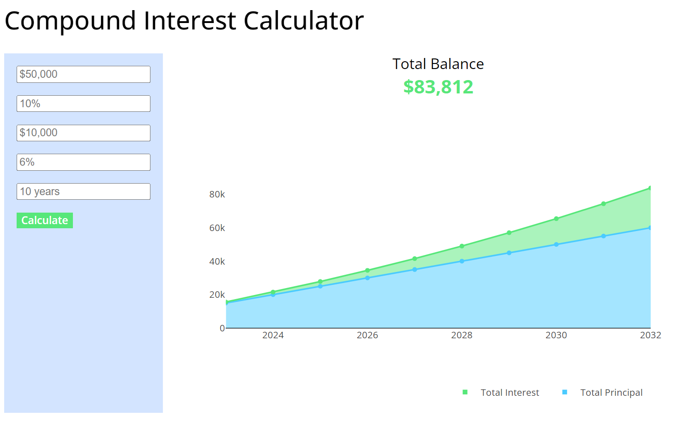

    

 

# 🤔 What is this?

A calculator that can be used to calculate and visualize the change in an investment's total balance over time, accounting for compound interest.

    
    
Compound Interest Calculator Screenshot

# 🎯 Objective

There are many compound interest calculators currently available online. However, most of these calculators are very basic and only allow projections based on a single investment. Meaning comprehensive solutions for financial forecasting are non-existent. 

If you're a finance-savvy investor, you're probably looking for something that offers a bit more functionality and can deliver more complex forecasts for your investments. 

This project will work towards that goal, and deliver a comprehensive solution to all your forecasting needs.

# ✏️ Usage

**NOTE:** This application is not currently registered with a domain nor is it hosted anywhere on the web while in development. Therefore, the only current way to run this application is via opening rendering it with your local machine. Instructions are included below:

### Step 1: Clone this repository

You can clone this repository using the `git` command-line-tool (CLI), GitHub Desktop, or by simply downloading the .zip file

### Step 2: Open the HTML file

Once you've cloned the repository, go to the folder, navigate to `index.html`, and open it with your favorite web browser. **NOTE:** Do not open this file with a text editor; make sure to use a web browser to ensure it renders correctly.

### Step 3: Make your projections!

When you've opened `index.html` in your browser, you should see a default plot of an investment over time as well as some parameters to the left you can change. Start playing around with different salaries, rates of return, and time periods and watch your investment grow!

# 🔨 Development

This project is still in (very) early development, and currently only offers very basic compound interest calculations akin to the other available apps. However, a tentative list of planned features is included below:

- **💸 Annual contributions aligned with salary projections**
    - A fixed annual contribution to an investment is not reflective of reality. As our salaries grow, and debts are paid off, we have more disposable income to invest. Therefore, I'd like to include a feature that takes this projected salary growth into account to provide a more accurate picture of how a portfolio will grow over time.

- **📈 Accounting for variation in market conditions**
    - Using a fixed rate for expected returns is also not realistic, as market conditions can and will change year to year. If we consider the S&P 500, for instance, [the average annual return (AAR) is ~10.13% per year. However, as recently as 2022, the S&P 500 returned -18.01%!](https://www.investopedia.com/ask/answers/042415/what-average-annual-return-sp-500.asp) We expect that kind of variation, but the model does not. Therefore, we can account for this variation by offering best, average, and worst cases for projections. 

- **📊 Blended Portfolios**
    - Another unrealisitc assumption is that a portfolio is only composed of a single investment with a single corresponding expected rate of return. If you're portfolio is blended with indexes, individual stocks, and certified deposits, these three assets will likely have very different AAR based on the relative amount of risk associated with each. Thus we want to include feature(s) to project accounting for diverse portfolios.

# 💙 Contributors

**Blake McBride**   eskin22  